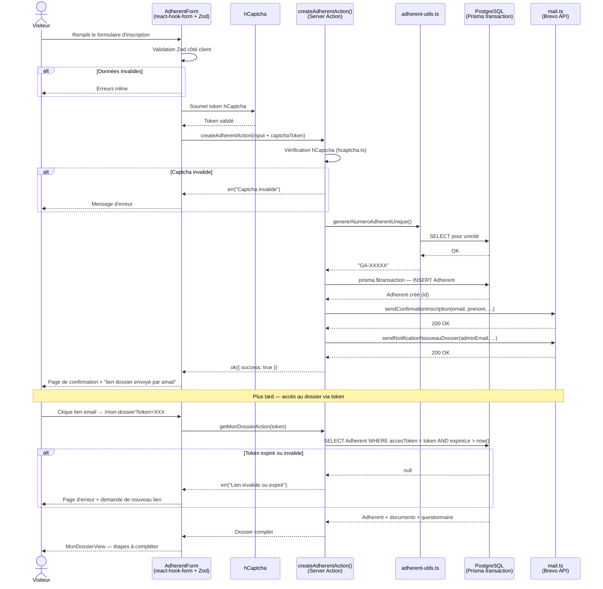

```mermaid
sequenceDiagram
  actor Visiteur
  participant Form as AdherentForm<br/>(react-hook-form + Zod)
  participant hCap as hCaptcha
  participant Action as createAdherentAction()<br/>(Server Action)
  participant Utils as adherent-utils.ts
  participant DB as PostgreSQL<br/>(Prisma transaction)
  participant Mail as mail.ts<br/>(Brevo API)

  Visiteur->>Form: Remplit le formulaire d'inscription
  Form->>Form: Validation Zod côté client

  alt Données invalides
    Form-->>Visiteur: Erreurs inline
  end

  Form->>hCap: Soumet token hCaptcha
  hCap-->>Form: Token validé

  Form->>Action: createAdherentAction(input + captchaToken)
  Action->>Action: Vérification hCaptcha (hcaptcha.ts)

  alt Captcha invalide
    Action-->>Form: err("Captcha invalide")
    Form-->>Visiteur: Message d'erreur
  end

  Action->>Utils: genererNumeroAdherentUnique()
  Utils->>DB: SELECT pour unicité
  DB-->>Utils: OK
  Utils-->>Action: "GA-XXXXX"

  Action->>DB: prisma.$transaction — INSERT Adherent
  DB-->>Action: Adherent créé (id)

  Action->>Mail: sendConfirmationInscription(email, prenom, ...)
  Mail-->>Action: 200 OK

  Action->>Mail: sendNotificationNouveauDossier(adminEmail, ...)
  Mail-->>Action: 200 OK

  Action-->>Form: ok({ success: true })
  Form-->>Visiteur: Page de confirmation + "lien dossier envoyé par email"

  Note over Visiteur,Mail: Plus tard — accès au dossier via token

  Visiteur->>Form: Clique lien email → /mon-dossier?token=XXX
  Form->>Action: getMonDossierAction(token)
  Action->>DB: SELECT Adherent WHERE accesToken = token AND expireLe > now()

  alt Token expiré ou invalide
    DB-->>Action: null
    Action-->>Form: err("Lien invalide ou expiré")
    Form-->>Visiteur: Page d'erreur + demande de nouveau lien
  end

  DB-->>Action: Adherent + documents + questionnaire
  Action-->>Form: Dossier complet
  Form-->>Visiteur: MonDossierView — étapes à compléter
```
