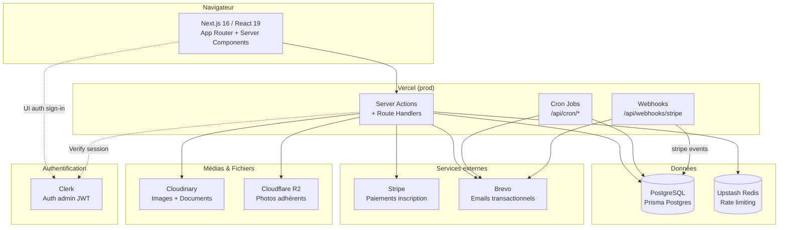

# 1. Vue d'ensemble & architecture

[← Retour au sommaire](./README.md)

## 1.1 Objectif de l'application

Plateforme web associative couvrant trois besoins :

1. **Site vitrine public** — accueil, disciplines, actualités, galerie photos, contact.
2. **Tunnel d'adhésion en ligne** — inscription, espace « Mon dossier » accessible par lien email, upload de documents, questionnaire santé, signature du règlement, paiement Stripe.
3. **Back-office d'administration** — gestion des adhérents, essayants, contenus, tarifs et configuration, protégé par Clerk.

## 1.2 Stack technique

| Couche | Outil |
|---|---|
| Framework | Next.js 16.1.5 (App Router), React 19 |
| Langage | TypeScript 5.9 |
| Base de données | PostgreSQL + Prisma 7 (adapter `pg` / Prisma Postgres) |
| Authentification | Clerk (`@clerk/nextjs` 6) |
| Images | Cloudinary (`next-cloudinary` + SDK) |
| Documents | Cloudflare R2 (SDK S3 AWS) — photos adhérents uniquement |
| Email | Brevo (API HTTP) |
| Paiements | Stripe 21 |
| UI | Tailwind CSS v4, Lucide React, dnd-kit, TipTap (rich text) |
| Formulaires | react-hook-form + Zod (`@hookform/resolvers`) |
| Gestion d'erreurs | neverthrow (`Result` / `ResultAsync`) |
| Captcha | hCaptcha |
| Tests | Vitest 4 + `@testing-library/react` |
| CI/CD | GitHub Actions |
| Déploiement | Vercel |

## 1.3 Schéma d'architecture



## 1.4 Principes d'architecture

- **Feature-based + Clean Architecture.** Chaque module métier est isolé sous `src/features/[feature]/` et structuré en couches `domain` (modèles, use-cases, interfaces de repository), `data` (datasources Postgres + implémentations de repository) et `presentation` (composants admin/front).
- **Mutations via Server Actions.** Toutes les écritures en base passent par des Server Actions (`'use server'`). La **seule vraie API route** est le webhook Stripe ; s'y ajoutent les routes cron.
- **Monade Result.** La logique métier renvoie des `Result`/`ResultAsync` (neverthrow) plutôt que de lever des exceptions.
- **Client Prisma généré.** Le client est généré dans `src/generated/prisma`. Toujours importer depuis `@/generated/prisma` (et `@/generated/prisma/enums` pour les enums).

> ⚠️ Deux patterns coexistent (voir [§3](./03-modules.md)) : Clean Architecture « complète » (gallery, actualites, disciplines) et DDD v2 « thin Server Actions → use-cases → repositories » (adherents, essayants sur le bounded context `adhesion`).

## 1.5 Arborescence

```
src/
  app/
    (front)/[route]/        # pages publiques (accueil, disciplines, contact, mon-dossier…)
    admin/[route]/          # pages admin (protégées Clerk)
    coach/                  # portail coach (accès par CoachToken)
    login/                  # page de connexion Clerk custom
    api/
      webhooks/stripe/      # webhook Stripe (seule vraie API route)
      cron/                 # tâches cron (rappel dossier, réinit saison)
  features/[feature]/
    domain/                 # models (Zod), use-cases, interfaces repository
    data/                   # datasources Postgres + repository impl
    presentation/components/
      admin/                # composants interface admin
      front/                # composants publics
  shared/
    lib/                    # prisma, mail, upload, token, csv, rate-limit, hcaptcha…
    components/             # CloudImage, ImageSlot*, ui/*
  generated/prisma/         # client Prisma généré (ne pas éditer)
  proxy.ts                  # middleware Clerk (⚠ nommé proxy.ts, pas middleware.ts)
prisma/schema.prisma        # schéma de données
```

## 1.6 Points d'attention architecturaux

| | Point | Détail |
|---|---|---|
| ⚠️ | Middleware non conventionnel | Le middleware Clerk est dans `src/proxy.ts` (Next.js attend `middleware.ts`). |
| ℹ️ | Double chemin d'upload | Photos adhérents → R2 (`upload.actions.ts`) ; documents & images publiques → Cloudinary (`shared/lib/upload.ts`). `uploadDocumentFile()` upload sur **Cloudinary** malgré son nom. |
| ℹ️ | Architecture hybride | `adherents`/`essayants` ont migré en DDD v2, mais leurs datasources vivent dans le bounded context partagé `adhesion/data`. |
| ℹ️ | Pas de modèle `User` | L'auth admin est entièrement déléguée à Clerk ; aucune table `Administrateur`. |
