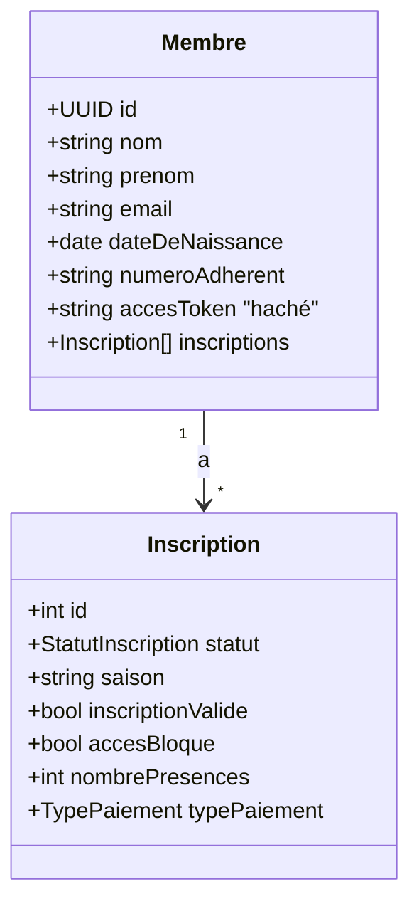

# 2. Modèle de données

[← Retour au sommaire](./README.md)

## 2.1 Modèle conceptuel (MCD)

```mermaid
erDiagram
  COMMUNE {
    string codeInsee PK
    string nom
  }

  MEMBRE {
    uuid id PK
    string nom
    string prenom
    string email UK
    string telephone
    string sexe
    string ville
    string codePostal
    string adresse
    string codeInsee FK
    date dateDeNaissance
    string numeroAdherent UK
    string accesToken "haché SHA-256"
    datetime accesTokenExpireLe
    datetime dateCreation
  }

  INSCRIPTION {
    int id PK
    enum statut
    string saison
    string membreId FK
    string photo
    enum certificatMedical
    enum autorisationParentale
    boolean autorisationSortieSeul "null=N/A, true=oui, false=non"
    enum couponSport
    enum bonCaf
    enum reglementSigne
    boolean engagementPrisConnaissance
    boolean inscriptionValide
    boolean accesBloque
    boolean fnsmr
    boolean droitImage
    boolean oxygene
    boolean renouvellement
    enum typePaiement
    decimal montantSnapshot
    enum categorie
    int nombrePresences
    datetime dateInscription
    string stripeSessionId
  }

  PRESENCE_ESSAI {
    int id PK
    datetime pointeLe
    string pointePar
    int inscriptionId FK
  }

  DOCUMENT {
    uuid id PK
    string type
    string name
    string url
    datetime createdAt
    int inscriptionId FK
  }

  QUESTIONNAIRE_SANTE {
    int id PK
    string type
    datetime createdAt
    int inscriptionId FK UK
  }

  QUESTION {
    int id PK
    string label UK
    string type
    int ordre
    string section
  }

  REPONSE {
    int id PK
    boolean reponse
    int questionnaireSanteId FK
    int questionId FK
  }

  INTERROGE {
    int questionnaireSanteId FK
    int questionId FK
  }

  IMAGE_CATEGORY {
    int id PK
    string name
    string slug UK
  }

  IMAGE {
    uuid id PK
    string title
    string alt
    string publicId UK
    int order
    int categoryId FK
  }

  DISCIPLINE {
    uuid id PK
    string title
    string slug UK
    boolean active
    int order
  }

  ACTUALITE {
    uuid id PK
    string title
    string slug UK
    boolean active
    boolean featured
    datetime publishedAt
  }

  CONFIG_TARIFS {
    int id PK
    string saison
    decimal tarifEnfant
    decimal tarifAdos
    decimal tarifAdulte
    decimal supplementOxygene
    decimal deductionCouponSport
  }

  COACH_TOKEN {
    int id PK
    string token UK
    datetime expireLe
  }

  REGLEMENT_INTERIEUR {
    int id PK
    text contenu
    datetime modifieLe
  }

  COMMUNE ||--o{ MEMBRE : "localise"
  MEMBRE ||--o{ INSCRIPTION : "a"
  INSCRIPTION ||--o{ PRESENCE_ESSAI : "a"
  INSCRIPTION ||--o{ DOCUMENT : "contient"
  INSCRIPTION ||--o| QUESTIONNAIRE_SANTE : "a"
  QUESTIONNAIRE_SANTE ||--o{ REPONSE : "contient"
  QUESTIONNAIRE_SANTE ||--o{ INTERROGE : "liste"
  QUESTION ||--o{ REPONSE : "reçoit"
  QUESTION ||--o{ INTERROGE : "figure dans"
  IMAGE_CATEGORY ||--o{ IMAGE : "regroupe"
```

## 2.2 Bounded context Adhésion (Membre / Inscription)

Le cœur métier sépare deux notions, conçues pour qu'un même individu traverse les saisons sans duplication :

- **`Membre`** — identité **pérenne** (UUID). Porte les coordonnées, la date de naissance, le numéro d'adhérent et le token d'accès (haché). Un membre possède plusieurs inscriptions.
- **`Inscription`** — adhésion **par saison** (id autoincrement). Porte l'état du dossier : statut, documents, questionnaire, paiement, présences.

Ce bounded context est **partagé** par les modules `adherents` et `essayants` : un essayant et un adhérent sont deux `Inscription` du même `Membre`, distinguées par `statut`.



## 2.3 Modèles Prisma

### Médias & contenus
| Modèle | Description |
|---|---|
| `ImageCategory` | Catégories d'images de la galerie |
| `Image` | Image Cloudinary (publicId, version, format, dimensions, blur, ordre) |
| `Discipline` | Discipline du club (coach, description, tags, images, SEO) |
| `Actualite` | Actualité (titre, description, tags, images, `featured`, `publishedAt`) |

### Adhésion
| Modèle | Description |
|---|---|
| `Membre` | Identité pérenne du membre |
| `Inscription` | Adhésion par saison |
| `PresenceEssai` | Présence pointée lors d'une séance d'essai |
| `Document` | Fichier uploadé (certificat médical, photo, règlement…) |
| `Commune` | Référentiel BAN (codeInsee + nom), peuplé à la volée |

### Questionnaire santé (normalisé)
| Modèle | Description |
|---|---|
| `QuestionnaireSante` | En-tête lié à une inscription (1–1) |
| `Question` | Référentiel de questions (majeur/mineur, section, ordre) |
| `Reponse` | Réponse booléenne pour un couple questionnaire/question |
| `Interroge` | Liste des questions posées pour un questionnaire donné |

### Configuration
| Modèle | Description |
|---|---|
| `ConfigTarifs` | Tarifs par saison (enfant, ados, adulte, suppléments, déductions) |
| `CoachToken` | Token temporaire d'accès coach |
| `ReglementInterieur` | Contenu du règlement intérieur (singleton) |
| `Association` | Coordonnées / bureau / réseaux sociaux (singleton, voir [§3](./03-modules.md)) |

## 2.4 Enums

| Enum | Valeurs |
|---|---|
| `StatutInscription` | `ESSAYANT`, `ACTIF`, `BLOQUE`, `ARCHIVE` |
| `StatutDocument` | `non_fourni`, `declare`, `valide` |
| `TypePaiement` | `sur_place`, `en_ligne` |
| `Categorie` | `enfant`, `ados`, `adulte` |

> La catégorie est calculée à partir de la date de naissance (`calculerCategorie()` dans `shared/lib`).

## 2.5 Notes de modélisation

- `autorisationSortieSeul` est un `Boolean?` à **trois états** : `null` (non répondu), `true` (autorisé), `false` (non autorisé).
- `montantSnapshot` fige le tarif au moment de l'inscription (indépendant des évolutions de `ConfigTarifs`).
- `accesToken` n'est **jamais stocké en clair** : seul son hash SHA-256 est persisté (voir [§5](./05-securite.md)).
- Il n'existe **pas** de table `User`/`Administrateur` : Clerk matérialise l'admin ; l'attribution se fait via un snapshot `userId` Clerk (champ `modifiePar` sur `Association`).
