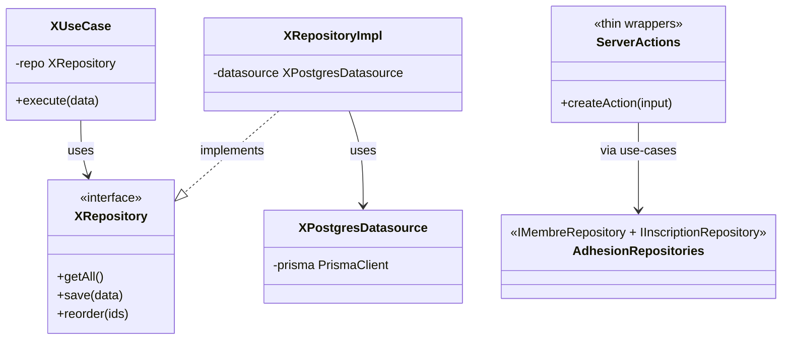

# 3. Modules métier

[← Retour au sommaire](./README.md)

L'application compte **8 modules** sous `src/features/`. Deux patterns d'architecture coexistent.

## 3.1 Deux patterns d'architecture

| Pattern | Modules | Forme |
|---|---|---|
| **Clean Architecture complète** | `gallery`, `actualites`, `disciplines` | `datasource → repositoryImpl → repository(interface) → use-cases → presentation` |
| **DDD v2 « thin Server Actions »** | `adherents`, `essayants` | Server Actions minces → use-cases isolés → `IMembreRepository`/`IInscriptionRepository` (implémentés dans `adhesion/data`) |
| **Thin direct (config singleton)** | `association` | Server Action → Prisma directement (pas de use-case/repository) |

---

## 3.2 Module Actualites

Clean Architecture (data / domain / presentation).

- **Modèle** : `Actualite { id, title, description, tags[], active, featured, images[], imageOrder[], seo, order, publishedAt }`
- **Use-cases** : `get-active`, `get`, `get-featured`, `getAll`, `reorder`, `save`
- **Présentation** : admin (`ActualiteForm`, `ActualiteManager`, `ActualiteTable`) · front (`ActualiteCard`, `ActualitesCarousel`, `ActualitesSection`)

## 3.3 Module Disciplines

Clean Architecture.

- **Modèle** : `Discipline { id, title, coach, category, citation?, description, tags[], active, images[], coachImage?, seo, order }`
- **Use-cases** : `get-active`, `get`, `getAll`, `reorder`, `save`
- **Présentation** : admin (`DisciplineForm`, `DisciplineManager`, `DisciplineTable`) · front (`CarouselDiscipline`, `DisciplineSection`)

## 3.4 Module Gallery

Clean Architecture — **module le plus testé** du projet (10+ fichiers de test).

- **Modèles** : `Image`, `ImageCategory { id, name, slug }`
- **Use-cases** (tous testés) : `getAll`, `getByCategory`, `save`, `save-many`, `delete`, `bulk-delete`, `reorder`
- **Présentation** : `GalleryManager`, `GalleryGrid`, `GalleryListView`, `Lightbox`, `AddImagesDialog`, `EditImageDialog`, `SelectionToolbar`…
- **Hooks** : `useImageCollection`, `useKeyboardNavigation`, `useLightbox`

## 3.5 Bounded context Adhesion (partagé)

Cœur du domaine — sépare `Membre` (identité) et `Inscription` (adhésion saisonnière). Voir [§2.2](./02-modele-de-donnees.md).

- **Interfaces de repository** :
  - `IMembreRepository` : `findById`, `findByEmail`, `findByToken` (par hash), `findByEmailAndNumero`, `findAllWithInscription`, `create`, `updateToken`, `generateUniqueNumero`, `updateAdresse`
  - `IInscriptionRepository` : lecture (par id, token, sessionStripe, essayants, adhérents…), écriture, présences, documents, questionnaire, config
- **Data** : datasources + implémentations Postgres pour `Membre` et `Inscription` (testés).

## 3.6 Module Adherents

DDD v2 — Server Actions minces sur des use-cases isolés.

- **Use-cases front** : `createAdherent`, `getMonDossier`, `createCheckout`, `soumettreQuestionnaire`, `signerReglement`, `setTypePaiement`, `patchAutorisationSortie`, `updateAdresse`, `updateTelephone`, `updateDroitImage`, `validerEngagement`, `uploadDocumentAdherent`
- **Use-cases admin** : `getAdherents`, `getAdherentById`, `patchAdherent`, `validerDocument`, `notifierRejetDossier`
- **Présentation** : admin (`AdherentDetail`, `AdherentsList`, `ConfigTarifsForm`, `ExportCsvButton`) · front (`AdherentForm`, `AdresseAutocomplete`, `MonDossierView`)

**Règles métier clés :**
| Règle | Détail |
|---|---|
| Accès dossier par token | `Membre.accesToken` haché SHA-256, avec expiration |
| Paiement | Stripe Checkout Session ; `montantSnapshot` figé |
| Documents | Upload Cloudinary ; remplacement si même type déjà présent |
| Règlement intérieur | État final déclaratif (`reglementSigne`), sans validation admin |
| Autorisation sortie seul | État final à 3 valeurs (`null`/`true`/`false`) |
| Export CSV | `exportAdherentsCsvAction()` → `toCsv()` (séparateur `;`, BOM UTF-8) |
| Adresse | Autocomplétion via API Adresse BAN (data.gouv.fr) côté client ; stockage `Commune` |

## 3.7 Module Essayants (essai libre)

DDD v2.

- **Use-cases** : `createEssayant`, `requestAccesEssai`, `getMonEssai`, `pointerPresence`, `getEssayantConversionData`, `getEssayantsForCoach`
- **Présentation** : admin (`CoachTokenManager`) · coach (`CoachDashboard`) · front (`EssaiForm`, `MonEssaiView`)

**Règles métier clés :**
| Règle | Détail |
|---|---|
| Blocage | 3 présences max → `accesBloque = true` |
| Conversion | Essayant → Adhérent possible après 3 présences ; un `newToken` est généré (le brut n'est plus re-servi) |
| Accès coach | `CoachToken` temporaire (sans compte Clerk) requis pour pointer |
| Token essai | Stocké haché, même pattern que les adhérents |

## 3.8 Module Inscriptions

Composant front uniquement : `InscriptionSection.tsx` (section d'entrée du tunnel).

## 3.9 Module Association (config singleton)

Pattern **thin** (Server Action → Prisma direct), calqué sur `ConfigTarifs`/`ReglementInterieur`.

- **Rôle** : source unique de vérité des infos publiques (coordonnées, bureau, réseaux), affichées sur la **page Contact** et le **footer**.
- **Actions** : `getAssociationAction()` (dernière ligne ou **valeurs par défaut** si table vide → le front ne casse jamais) · `updateAssociationAction()` (garde `auth()` Clerk, validation Zod email + URLs http/https, `modifiePar = userId`).
- **Sécurité** : URLs réseaux restreintes à http/https (exclut `javascript:`, `data:`). Carte Contact via iframe OpenStreetMap (RGPD-friendly, géoloc codée en dur).

## 3.10 Module Dashboard Admin

`AdminDashboard.tsx`, `ActivityItem.tsx`, `ModuleCard.tsx` — vue d'accueil du back-office.

---

## 3.11 Bibliothèque partagée (`src/shared/lib/`)

| Fichier | Rôle |
|---|---|
| `prisma.ts` | Singleton `PrismaClient` (pool pg) |
| `mail.ts` | ~21 fonctions `send*` — emails via Brevo |
| `upload.ts` | `uploadDocumentFile()`, `uploadPublicImage()` → **Cloudinary** |
| `cloudinary.server.ts` | Blur base64, suppression d'assets |
| `token.ts` | `hashToken()` — SHA-256 des tokens d'accès |
| `result.ts` | Re-exports neverthrow + numéros uniques + `calculerCategorie()` |
| `rate-limit.ts` | `checkRateLimit()`, `getClientIp()` (Upstash en prod, mémoire en dev) |
| `csv.ts` | `escapeCsvField()`, `toCsv()` |
| `hcaptcha.ts` | Vérification hCaptcha |
| `sanitize.ts` | Nettoyage du HTML produit par TipTap |
