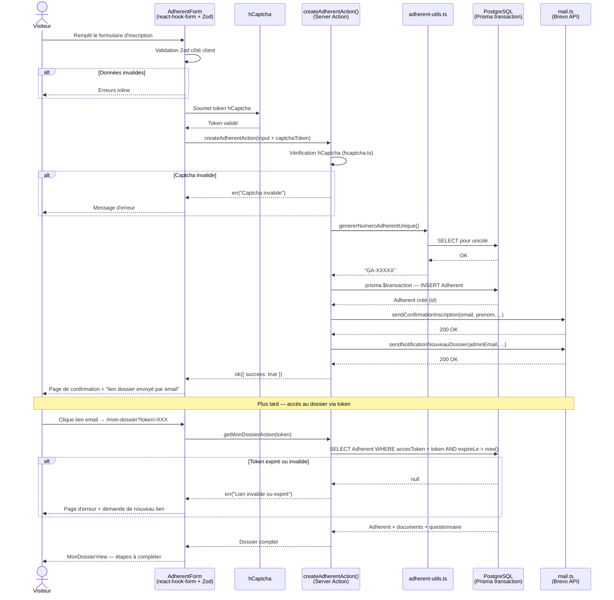

# 4. Parcours utilisateurs

[← Retour au sommaire](./README.md)

## 4.1 Acteurs

| Acteur | Mode d'identification |
|---|---|
| **Visiteur** | Aucun (public) |
| **Adhérent** | Token reçu par email (`/mon-dossier?token=…`) |
| **Essayant** | Token reçu par email (`/mon-essai?token=…`) |
| **Coach** | `CoachToken` temporaire (sans compte) |
| **Admin** | Compte Clerk |

## 4.2 Cas d'usage

```mermaid
graph LR
  subgraph Acteurs
    VISITOR((Visiteur))
    ADHERENT((Adhérent<br/>token email))
    ESSAYANT((Essayant<br/>token email))
    COACH((Coach<br/>CoachToken))
    ADMIN((Admin<br/>Clerk))
  end

  subgraph Public["Accès public"]
    UC1[Voir accueil / disciplines / actualités]
    UC2[Voir galerie photos]
    UC3[S'inscrire comme adhérent]
    UC4[Demander un essai libre]
    UC5[Accéder à son dossier par email]
    UC6[Accéder à son espace essai par email]
  end

  subgraph DossierAdherent["Espace adhérent - token"]
    UC7[Voir son dossier complet]
    UC8[Soumettre le questionnaire santé]
    UC9[Signer le règlement intérieur]
    UC10[Choisir mode de paiement]
    UC11[Payer en ligne - Stripe]
    UC12[Uploader ses documents]
    UC13[Valider engagement / auto. sortie seul]
    UC28[Mettre à jour son adresse - BAN]
  end

  subgraph EspaceEssai["Espace essayant - token"]
    UC14[Voir ses présences]
    UC15[Voir les infos conversion]
  end

  subgraph EspaceCoach["Portail coach - CoachToken"]
    UC16[Voir liste essayants]
    UC17[Pointer une présence]
  end

  subgraph Admin["Administration - Clerk"]
    UC18[Voir dashboard]
    UC19[Gérer les adhérents]
    UC20[Valider les documents]
    UC21[Notifier rejet dossier]
    UC22[Gérer les essayants]
    UC23[Générer un token coach]
    UC24[Gérer actualités / disciplines / galerie]
    UC25[Configurer les tarifs]
    UC26[Éditer le règlement intérieur]
    UC27[Éditer questionnaire santé]
    UC29[Exporter CSV adhérents]
  end

  VISITOR --> UC1
  VISITOR --> UC2
  VISITOR --> UC3
  VISITOR --> UC4
  VISITOR --> UC5
  VISITOR --> UC6

  ADHERENT --> UC7
  ADHERENT --> UC8
  ADHERENT --> UC9
  ADHERENT --> UC10
  ADHERENT --> UC11
  ADHERENT --> UC12
  ADHERENT --> UC13
  ADHERENT --> UC28

  ESSAYANT --> UC14
  ESSAYANT --> UC15

  COACH --> UC16
  COACH --> UC17

  ADMIN --> UC18
  ADMIN --> UC19
  ADMIN --> UC20
  ADMIN --> UC21
  ADMIN --> UC22
  ADMIN --> UC23
  ADMIN --> UC24
  ADMIN --> UC25
  ADMIN --> UC26
  ADMIN --> UC27
  ADMIN --> UC29
```

## 4.3 Séquence — Inscription d'un adhérent puis accès au dossier

## 4.4 Cartographie des routes

### Pages publiques (`src/app/(front)/`)
`/` · `/actualites` · `/actualites/[id]` · `/contact` · `/disciplines` · `/essai` · `/inscription` · `/mentions-legales` · `/mon-dossier` · `/mon-essai`

### Pages admin (`src/app/admin/`) — protégées Clerk
`/admin/dashboard` · `/admin/club/adherents[/id]` · `/admin/club/coach-token` · `/admin/club/config-tarifs` · `/admin/club/essayants` · `/admin/content/{actualites,disciplines,gallery}` · `/admin/config/{association,reglement,sante,tarifs}`

### Autres
`/coach` (portail coach) · `/login/[[...sign-in]]` (Clerk) · `*` (404)

### API & tâches planifiées
| Route | Description |
|---|---|
| `POST /api/webhooks/stripe` | Webhook paiement Stripe |
| `GET /api/cron/dossier-incomplet` | Cron quotidien (9h) — rappel dossiers incomplets > 30j |
| `GET /api/cron/reinitialisation-saison` | Cron annuel (1er juillet 9h) — reset saison + email ouverture |
